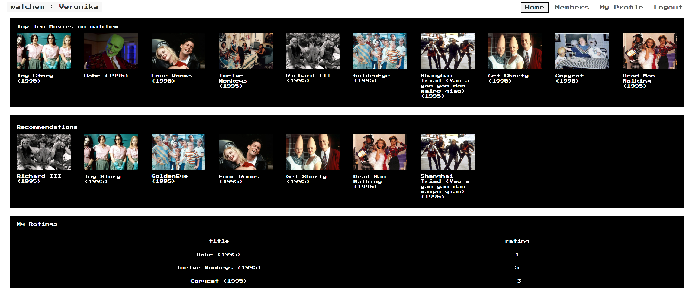

# watchem #

### What is this repository for? ###

* Movie recommender system based on data collected by MovieLens
* User receives recommendations based on their own ratings
* User can register, login and delete their profile
* User can rate and add movies, delete their ratings and change their profile information

### How do I get set up? ###

* to import project into eclipse cd into the project and 
```
play eclipsify
```


* to deploy locally cd into the project and 
```
play run
```


### Contribution guidelines ###
* Tests were written according to Right B.I.C.E.P. approach


### Deployment ###
Web app deployed to Heroku using small data set at [watchem.herokuapp.com](http://watchem.herokuapp.com/)


### Screenshots ###


<p float="left">
    
    
</p>





